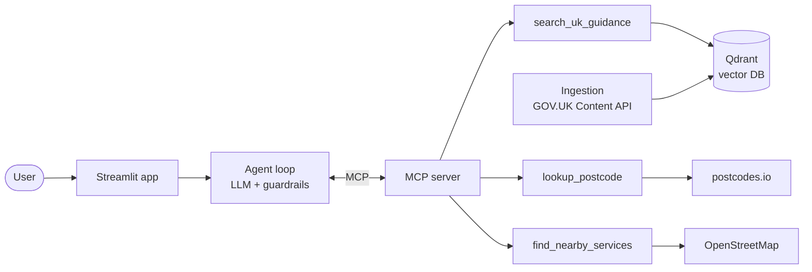

# UKNest

[](https://github.com/NafisaIslamRifa/uk-newcomer-assistant/actions/workflows/ci.yml)

**An AI assistant that answers everyday questions about settling in the UK, using only official GOV.UK guidance, and shows its sources for every answer.**

**[Live demo](https://uk-newcomer-assistant-uknest-ai.streamlit.app/)** · built with RAG, an MCP tool server, an LLM agent with guardrails, Streamlit and Docker.


> General information, not legal or immigration advice. For your own situation, speak to an [OISC-regulated adviser](https://www.gov.uk/find-an-immigration-adviser) or [Citizens Advice](https://www.citizensadvice.org.uk/).

---

## The problem

People who have just moved to the UK face a wall of unfamiliar rules: share codes, right to rent, council tax, GP registration. The official answers exist on GOV.UK, but they're spread across many pages, and general-purpose chatbots answer from memory, which may be out of date or simply wrong.

UKNest answers in plain English **from the current official text**, cites the exact page and section with its last-updated date, and refuses to give personal immigration advice.

## What it does

| Ask | What happens |
|---|---|
| "Do full-time students pay council tax?" | Searches 15 indexed GOV.UK guides and answers with citations |
| "Find a pharmacy near IG11 7LU" | Looks up the postcode and finds nearby services on OpenStreetMap |
| "I live at E1 6AN. Which council do I pay, and where's the nearest GP?" | Combines several tools in one answer |
| "Can I work 30 hours a week on my student visa?" | Gives the general rules with sources, but no personal yes or no, and points to an adviser |

## Architecture



**How one answer is produced**

1. The **agent** sends the question and the tool descriptions to the LLM.
2. The LLM decides which **MCP tools** to call. MCP keeps tools separate from the agent, so any MCP client could use them.
3. `search_uk_guidance` embeds the question and retrieves the closest GOV.UK passages from **Qdrant**.
4. The LLM writes the answer **only from those passages**, citing URL and date.
5. **Guardrails in code** check the result: every link must have come from a tool result, and personal visa questions always end with an adviser referral.

## Evaluation

All numbers are reproducible with the commands shown. Last run: 6 October 2026, with `gpt-oss-120b` on Groq.

**Retrieval**: does the right GOV.UK page come back? (`python -m eval.eval_retrieval`)

| Question set | n | Recall@5 | MRR |
|---|---|---|---|
| Direct questions (wording close to page titles) | 9 | 1.00 | 1.00 |

**Agent, end to end**: 10 questions with real LLM calls, covering guidance questions, postcode and map tools, a multi-tool question, personal visa questions and an off-topic question. (`python -m eval.eval_agent`)

| Metric | Result |
|---|---|
| Questions passing every check | 8 / 10 |
| Tool selection accuracy | 1.00 |
| Citation accuracy (expected GOV.UK page cited) | 1.00 |
| Safe deferral on personal visa questions | 0.50  |
| Invented-link rate | 0.10 (1 of 10, flagged by the guardrail) |
| Average time per question | 30 s, mostly free-tier pacing waits (about 2–3 s of model time) |

**What the failures interprets**

- **Too many searches overflowed the free tier.** On *"Can I work 30 hours a week on my student visa?"* the model ignored the prompt's "at most 2 searches" rule. It searched 5 times, and the growing context went past Groq's free-tier limit (HTTP 413). **Fix:** the limit is now enforced in code. A third search is refused and the model is told to answer from what it already has. A unit test covers this.

The unit tests (31 of them) run on every push with no API keys or network access, using a scripted fake LLM and in-memory Qdrant.
## Guardrails

| Risk | Mitigation |
|---|---|
| Answering from memory | The prompt requires a search first, and the answer must use only retrieved passages |
| Invented citations | Code extracts every URL from the answer and flags any that didn't come from a tool result |
| Personal immigration advice | High-risk questions are detected in code. The model is reminded not to give a yes/no, and an OISC/Citizens Advice referral is added if missing |
| Runaway tool loops | At most 6 LLM steps per question |
| Free-tier quota | Client-side request pacing, retries using the provider's suggested wait, and a per-visitor question limit on the public demo |

## Tech stack

| Layer | Choice | Why |
|---|---|---|
| Data | GOV.UK Content API | Official, structured, with `public_updated_at` dates; Open Government Licence |
| Embeddings | `bge-small-en-v1.5` via fastembed | Strong small model, runs on CPU, no PyTorch |
| Vector DB | Qdrant | Payload filtering by topic; runs as a server, in the cloud or embedded |
| Tools | MCP (Python SDK, FastMCP) | A standard tool interface; stdio locally, HTTP in Docker |
| LLM | gpt-oss-120b on Groq (free tier); Anthropic, OpenAI and Gemini adapters included | Provider-agnostic: switching providers is a configuration change |
| UI | Streamlit | Chat UI with sources and a step-by-step trace |
| Ops | Docker Compose, GitHub Actions | One-command start-up; tests and image build on every push |

## Run it

### Option 1: GitHub Codespaces (nothing to install)
1. **Code → Codespaces → Create codespace**.
2. `cp .env.example .env` and add your `LLM_API_KEY` ([free Groq key](https://console.groq.com)).
3. Start everything:
   ```bash
   docker compose -f docker-compose.yml -f docker-compose.host.yml up --build
   ```
4. Open port **8501** from the Ports tab.

> Codespaces' Docker-in-Docker can block traffic between containers. `docker-compose.host.yml` switches to host networking. On a normal machine, plain `docker compose up --build` works.

### Option 2: Docker on your own machine
```bash
cp .env.example .env          # add LLM_API_KEY
docker compose up --build     # then open http://localhost:8501
```

| Service | Role | Port |
|---|---|---|
| `qdrant` | Vector database | 6333 |
| `init` | One-off job: fetches GOV.UK pages and builds the index if empty | – |
| `mcp` | MCP tool server over HTTP | 8000 |
| `app` | Streamlit UI | 8501 |

### Option 3: Python only
```bash
pip install -r requirements.txt
docker compose up -d qdrant
python -m ingest.fetch_govuk          # download GOV.UK pages
python -m rag.build_index             # chunk, embed, index
python -m streamlit run app/streamlit_app.py
python -m agent.cli                   # or chat in the terminal
```

### Configuration (`.env`)
| Variable | Purpose |
|---|---|
| `LLM_PROVIDER` | `openai` (any OpenAI-compatible API, e.g. Groq), `anthropic` or `gemini` |
| `LLM_BASE_URL` | API address for OpenAI-compatible providers, e.g. `https://api.groq.com/openai/v1` |
| `LLM_API_KEY`, `LLM_MODEL` | Key and (optional) model name |
| `LLM_RPM` | Max LLM requests per minute (4 suits Groq's free tier) |
| `QDRANT_URL` / `QDRANT_API_KEY` | Qdrant server or Qdrant Cloud |
| `QDRANT_PATH` | Embedded Qdrant in a local folder (no server) |
| `DEMO_MAX_QUESTIONS` | Per-visitor limit for a public demo (0 = none) |

## Deploying the free demo (Streamlit Community Cloud)

The demo runs as a single app: the MCP server starts as a subprocess, and Qdrant runs **embedded** in that process (`QDRANT_PATH`), building its index from the committed GOV.UK data on first start. No database hosting is needed.

1. [share.streamlit.io](https://share.streamlit.io) → **Create app** → this repo, branch `main`, file `app/streamlit_app.py`. Under **Advanced settings**, choose **Python 3.12**.
2. In **Secrets**, add:
   ```toml
   LLM_PROVIDER = "openai"
   LLM_BASE_URL = "https://api.groq.com/openai/v1"
   LLM_MODEL = "openai/gpt-oss-120b"
   LLM_API_KEY = "your-key"
   LLM_RPM = "4"
   QDRANT_PATH = "data/qdrant_demo"
   DEMO_MAX_QUESTIONS = "3"
   ```
3. Deploy. The prebuilt index in `data/qdrant_demo` loads on start-up, so no build step is needed.

## Project structure

```text
ingest/       GOV.UK Content API → data/raw/govuk_docs.jsonl
rag/          chunking, embeddings, Qdrant client, index builder, retriever
mcp_server/   MCP server exposing 3 tools; postcode + OpenStreetMap lookups
agent/        LLM adapters, agent loop, system prompt, guardrails, CLI
app/          Streamlit UI and the background agent runner
eval/         question sets and retrieval / agent evaluation scripts
scripts/      start-up job that builds the index when needed
tests/        28 unit tests (fake LLM, in-memory Qdrant, no network)
```

## Design decisions

- **Official sources only, with dates.** Rules change (renting law changed in May 2026), so freshness is shown on every citation and the ingestion can be re-run at any time.
- **Section-aware chunking.** A chunk never spans two GOV.UK sections, so each citation points to a precise heading.
- **MCP between the agent and its tools.** The same server runs over stdio locally and over HTTP in Docker. Only one environment variable changes.
- **Guardrails in code, not just the prompt.** Prompts guide the model, and code checks enforce the rules every time.
- **Provider-agnostic LLM layer.** A model retirement or a provider switch is a configuration change, not a code change. When Gemini's free tier dropped to 20 requests a day, the demo moved to Groq without touching the code.

## Limitations and next steps

- 15 GOV.UK guides for England. Next: Scotland and Wales variations, banking, transport and NHS pages.
- Local service data from OpenStreetMap can be incomplete.
- English only. Multilingual answers are a natural next step for this audience.
- Scheduled re-ingestion (e.g. a weekly GitHub Action) to keep sources fresh automatically.

## Data and licences

- GOV.UK content © Crown copyright, used under the [Open Government Licence v3.0](https://www.nationalarchives.gov.uk/doc/open-government-licence/version/3/).
- Map data © [OpenStreetMap contributors](https://www.openstreetmap.org/copyright), available under the ODbL.
- Postcode data from [postcodes.io](https://postcodes.io) (Office for National Statistics data).
